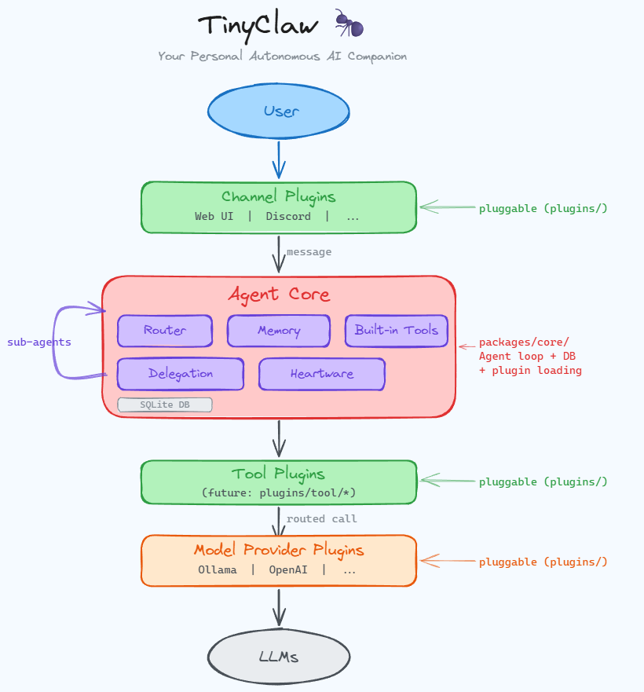

# TinyClaw 🐜


<!-- Created with GitHub Repo Banner by Waren Gonzaga: https://ghrb.waren.build -->

**Your autonomous AI companion.**

> [!WARNING]
> **🚧 Under Active Development** - This project is in heavy development and things will break. Running it now may spoil the experience we're building for you. Please wait for the first official release before trying it out. Follow [@TinyClawAI](https://x.com/TinyClawAI) and [@warengonzaga](https://x.com/warengonzaga) on X for launch updates.

AI agents today are powerful but complex, expensive to run, and heavy to set up. TinyClaw believes AI should be **simple, affordable, and truly personal**, like having your own Codsworth or AYLA as a helpful friend. It achieves this by being a **native framework built from scratch** with a tiny core, plugin architecture, self-improving memory, and smart routing that tiers queries to cut costs. The result is an **autonomous, self-improving, self-learning, and self-configuring personal AI companion** that grows with you over time.

Think of the **personal computer revolution**. Computers were once reserved for governments, military, and large corporations. Having one meant building it yourself or spending serious money. Then Apple came along and made them personal and accessible to everyone. TinyClaw does the same for AI agents.

## ❓ Why TinyClaw?

Most AI agent frameworks are powerful but heavy. They require expensive subscriptions, complex setup, and are built on top of other frameworks. TinyClaw takes a different approach. It's built from scratch, cheap to run, and treats you as a friend, not just a user to be served.

| | TinyClaw 🐜 | Other AI Agent Frameworks |
|---|---|---|
| **Architecture** | Native framework, built from scratch | Built on existing frameworks (Pi, Claude Code, Codex) |
| **Philosophy** | Personal companion with its own personality | Configurable assistant you shape from scratch |
| **Core size** | Tiny by design, everything else is a plugin | Large monolith that grows over time |
| **Personality** | Has its own, you can't override it | Fully configurable system prompts |
| **Memory** | Self-improving with temporal decay | Flat conversation history |
| **Setup** | Self-configuring, zero hassle | Complex onboarding with multiple dependencies |
| **Runtime** | Bun-native, single binary | Node.js 22+, pnpm, multiple processes |
| **Built-in Provider** | Ollama Cloud (free sign-up, generous free tier) | Requires Claude Pro/Max ($20-200/mo) or API keys |
| **Cost** | Smart routing slashes LLM spend by tiering queries | Every query hits the most expensive model |
| **Routing** | Adapts to whichever provider plugins you install | Hardcoded to a single provider |

## 💡 Philosophy

TinyClaw is inspired by personal AI companions from science fiction like **Codsworth** from Fallout (the loyal robot butler) and **AYLA** from Deliver Us Mars (the autonomous drone companion). It's not designed to be your employee or your robot slave. It's designed to be your **helpful friend** that can assist with your work, your projects, and your daily life, but on its own terms.

**The ant metaphor is intentional.** A single ant is tiny, but it's autonomous, it learns, it adapts, and it builds something greater over time. That's TinyClaw. Small by design, mighty by nature.

### Core Principles

- **Personal, not enterprise.** Built for _you_, not your org chart. Helps with your work and business as a friend, not as a tool.
- **Tiny core, plugin everything.** The core stays minimal. Channels, providers, and tools are all plugins.
- **Self-improving.** Learns from every conversation via episodic memory with temporal decay.
- **Self-configuring.** No manual config files. The agent configures itself through conversation.
- **Own personality.** Ships with a personality (Heartware system) that's uniquely its own.
- **Native, not wrapped.** Every component is built from scratch with zero dependency on external AI frameworks.
- **Easy to start.** Uses Ollama Cloud (gpt-oss-cloud-120b) as the built-in provider. Free to sign up with a generous free tier.
- **Cost-conscious.** Smart routing tiers queries across your installed providers. Cheap models handle simple stuff, powerful models only fire when needed.

## ✨ Features

| | Feature | Description |
|---|---|---|
| 🧠 | **Adaptive Memory** | 3-layer memory system (episodic, semantic FTS5, temporal decay) that learns what to remember and forget |
| 🤖 | **Self-Improving** | Behavioral pattern detection that makes the agent better with every interaction |
| 🔌 | **Plugin Architecture** | Channels, providers, and tools are all plugins. Core stays tiny |
| 🎭 | **Heartware Personality** | Built-in personality engine with SOUL.md and IDENTITY.md. It has its own character |
| 🧩 | **Smart Routing** | 8-dimension query classifier that adapts to your installed provider plugins, routing simple queries to cheap models and complex ones to powerful ones, cutting LLM costs |
| 🛡️ | **5-Layer Security** | Path sandbox, content validation, audit log, auto-backup, rate limiting |
| 🏗️ | **Delegation System** | Autonomous sub-agent orchestration with self-improving role templates |
| 💾 | **Easy Setup** | SQLite persistence with Ollama Cloud built-in. Free to sign up and start using immediately |
| ⚡ | **Bun-Native** | Built on Bun for maximum performance, minimal footprint |
| 🔄 | **Provider Fallback** | Multi-provider support (Ollama, OpenAI, Anthropic) with automatic failover |

## 🏛️ Architecture



Everything above the plugin line is the **tiny core**. Channels, extra providers, and additional tools live as plugins in `plugins/`.

## 🚀 Quick Start

### Install

```bash
bun install
```

### Run

```bash
bun start
```

Open [http://localhost:3000](http://localhost:3000). TinyClaw will walk you through the rest. No config files needed.

### Development

```bash
bun dev      # Development mode with hot reload
bun build    # Build all packages
bun test     # Run test suite
```

## 📁 Project Structure

```
tinyclaw/
  packages/          Core library packages (tiny, focused, no circular deps)
    core/            Agent loop, database, built-in Ollama provider
    types/           Shared interfaces (leaf dependency)
    config/          Zod-validated configuration engine
    heartware/       Personality engine + safety layers
    memory/          Adaptive memory with episodic + FTS5
    delegation/      Sub-agent orchestration + blackboard
    router/          Smart provider routing (8-dim classifier)
    learning/        Behavioral pattern detection
    sandbox/         Bun Worker code execution
    pulse/           Cron-like proactive scheduler
    plugins/         Plugin discovery and loading
    ...
  plugins/           Plugin packages (keep the core tiny)
    channel/         Messaging integrations (Discord, etc.)
    provider/        LLM providers (OpenAI, etc.)
    tool/            Additional agent tools
  src/
    cli/             CLI entry point
    web/             Web UI (Svelte)
```

## 🐛 Issues

Please report any issues and bugs by [creating a new issue here](https://github.com/warengonzaga/tinyclaw/issues/new/choose), also make sure you're reporting an issue that doesn't exist. Any help to improve the project would be appreciated. Thanks! 🙏✨

## 🙏 Sponsor

Like this project? Leave a star! ⭐⭐⭐⭐⭐

Want to support my work and get some perks? [Become a sponsor](https://github.com/sponsors/warengonzaga)! 💖

Or, you just love what I do? [Buy me a coffee](https://buymeacoffee.com/warengonzaga)! ☕

Recognized my open-source contributions? [Nominate me](https://stars.github.com/nominate) as GitHub Star! 💫

## 📋 Code of Conduct

Read the project's [code of conduct](https://github.com/warengonzaga/tinyclaw/blob/main/CODE_OF_CONDUCT.md).

## 📃 License

This project is licensed under [MIT License](https://opensource.org/license/MIT).

## 🙏 Credits

- Inspired by [OpenClaw](https://github.com/openclaw/openclaw)
- Smart routing inspired by [ClawRouter](https://github.com/BlockRunAI/ClawRouter)
- Learnings applied from [Nader Dabit](https://x.com/dabit3)'s post on [You Could've Invented OpenClaw](https://x.com/dabit3/status/2021387483364151451)

## 📝 Author

This project is created by [Waren Gonzaga](https://github.com/warengonzaga), with the help of awesome [contributors](https://github.com/warengonzaga/tinyclaw/graphs/contributors).

[](https://github.com/warengonzaga/tinyclaw/graphs/contributors)

---

💻💖☕ by [Waren Gonzaga](https://warengonzaga.com) | [YHWH](https://www.youtube.com/watch?v=VOZbswniA-g) 🙏 - Without _Him_, none of this exists, _even me_.
